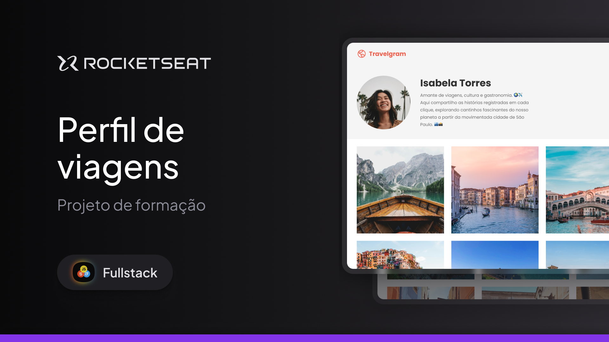

<h1 align="center">🌍 Projeto Travelgram</h1>

<p align="center">
  Uma página de perfil de viagens com foco em layout moderno, galeria de fotos e prática de HTML + CSS.
</p>

<p align="center">
  <a href="#-sobre">Sobre</a>&nbsp;&nbsp;&nbsp;|&nbsp;&nbsp;&nbsp;
  <a href="#-layout">Layout</a>&nbsp;&nbsp;&nbsp;|&nbsp;&nbsp;&nbsp;
  <a href="#-tecnologias">Tecnologias</a>&nbsp;&nbsp;&nbsp;|&nbsp;&nbsp;&nbsp;
  <a href="#-aprendizados">Aprendizados</a>
</p>

---

## 📌 Sobre

O **Travelgram** é uma interface estática que simula o perfil de um viajante, com:

- barra de navegação;
- seção de apresentação do usuário;
- indicadores de localização/viagens/fotos;
- galeria com 12 imagens;
- rodapé institucional.

Projeto ideal para treinar **estrutura semântica em HTML** e **organização de estilos em múltiplos arquivos CSS**.

---

## 🖼️ Layout


```md

```

---

## 🚀 Tecnologias

Este projeto foi desenvolvido com:

- **HTML5**
- **CSS3**
- **Google Fonts (Poppins)**

---

## 💡 Aprendizados

Durante a construção deste projeto, foram praticados conceitos como:

- composição de layout com containers;
- separação de estilos por responsabilidade (`nav.css`, `header.css`, `main.css`, etc.);
- uso de variáveis e padronização visual;
- ajustes de espaçamento e alinhamento para melhor legibilidade.

---

## 👨‍💻 Autor

Feito por **Gabriel Tobler**.

- GitHub: [@toblergabriel](https://github.com/toblergabriel)
- Instagram: [@gabrielloiro_](https://www.instagram.com/gabrielloiro_?igsh=emNheXF3aWZ6eGpi)